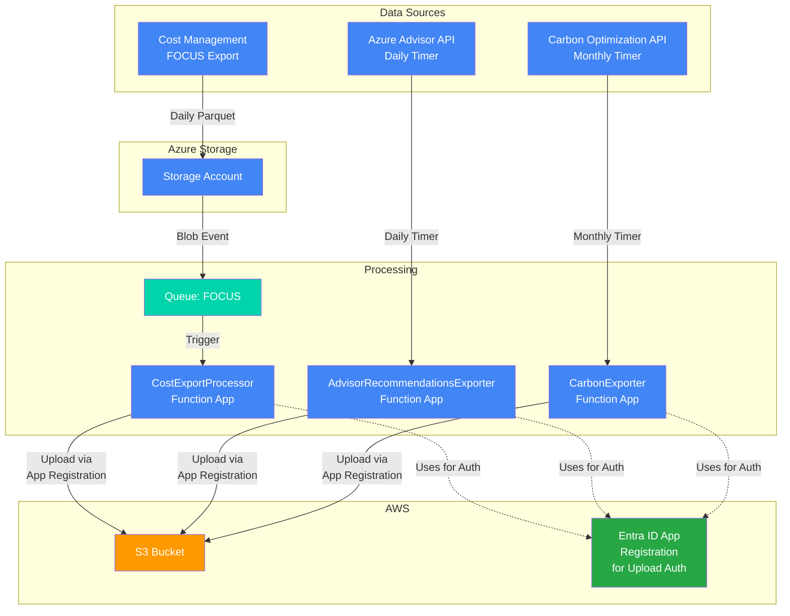

<!-- markdownlint-disable -->

<!-- markdownlint-restore -->
<!--
  ***** CAUTION: DO NOT EDIT ABOVE THIS LINE ******
-->


# terraform-azure-focus

## Description

This Terraform module exports Azure cost-related data and forwards to AWS S3. The supported data sets are described below:

- **Cost Data**: Daily parquet files containing standardized cost and usage details in FOCUS format
- **Azure Advisor Recommendations**: Daily JSON files containing cost optimization recommendations from Azure Advisor
- **Carbon Emissions Data**: Monthly JSON reports with carbon footprint metrics across Scope 1 and Scope 3 emissions

> [!NOTE]  
> There is currently an [issue](https://github.com/hashicorp/terraform-provider-azurerm/issues/29993?source=post_page-----99ff43c1557f---------------------------------------) with publishing Function App code on the Flex Consumption Plan using a managed identity. We have had to revert to using the storage account connection string for now. More details can be found [here](https://medium.com/azure-terraformer/azure-functions-with-flex-consumption-and-managed-identity-is-broken-99ff43c1557f) (behind a paywall, sadly).

## Architecture

This module creates a fully integrated solution for exporting multiple Azure datasets and forwarding them to AWS S3. The following diagram illustrates the data flow and component architecture for all three export types:



### Data Flow

The module creates three distinct export pipelines for each of the data sets:

#### FOCUS Cost Data Pipeline
1. **Daily Export**: Cost Management exports daily FOCUS-format cost data (Parquet files) to Azure Storage
2. **Event Trigger**: Blob creation events trigger the `CostExportProcessor` function via storage queue
3. **Processing**: Function processes and transforms the data (removes sensitive columns, restructures paths)
4. **Upload**: Processed data uploaded to S3 in partitioned structure: `billing_period=YYYYMMDD/`

#### Azure Advisor Recommendations Pipeline  
1. **Daily Trigger**: `AdvisorRecommendationsExporter` function runs daily at 2 AM (timer trigger)
2. **API Call**: Function calls Azure Advisor Recommendations API for all subscriptions in scope, filtering for cost category recommendations
3. **Processing**: Response data formatted as JSON with subscription tracking and date metadata
4. **Upload**: JSON data uploaded to S3 in partitioned structure: `gds-recommendations-v1/billing_period=YYYYMMDD/`

#### Carbon Emissions Pipeline
1. **Monthly Trigger**: `CarbonEmissionsExporter` function runs monthly on the 20th (timer trigger)
2. **API Call**: Function calls Azure Carbon Optimization API for previous month's Scope 1 & 3 emissions
3. **Processing**: Response data formatted as JSON with date range validation (2024-06-01 to 2025-06-01)
4. **Upload**: JSON data uploaded to S3 in partitioned structure: `billing_period=YYYYMMDD/`

#### Common Authentication Flow
- Function Apps use Managed Identity to authenticate with Entra ID Application  
- Entra ID Application uses OIDC federation to assume AWS IAM Role
- All data transfers secured with cross-cloud federation (no long-lived AWS credentials)
- Application Insights provides telemetry and monitoring for all pipelines

### Security Features

- **Private Networking**: All components use private endpoints and VNet integration
- **Zero Trust**: No public network access (except during deployment if `deploy_from_external_network=true`)
- **Managed Identity**: Azure resources authenticate using system-assigned managed identities
- **Cross-Cloud Federation**: OIDC federation eliminates need for long-lived AWS credentials

## Prerequisites

- An existing virtual network with two subnets, one of which has a delegation for Microsoft.App.environments (`function_app_subnet_id`).
- Role assignments:
  - User Access Administrator and Contributor (or Owner) at the scope of the subscription you are provisioning resources to
  - Cost Management Contributor at the billing account scope(s) (where cost exports will be created)
  - User Access Administrator (or Owner) at the Tenant Root Management Group scope*

> [!TIP]
> \* *Role assignment privileges can be constrained to Carbon Optimization Reader, Management Group Reader and Reader*

## Usage

```hcl
provider "azurerm" {
  # These need to be explicitly registered
  resource_providers_to_register = ["Microsoft.CostManagementExports", "Microsoft.App"]
  features {}
}

module "example" {
  source                              = "git::https://github.com/co-cddo/terraform-azure-focus?ref=<ref>" # TODO: Add commit SHA

  aws_account_id                      = "<aws-account-id>"
  report_scope                        = "/providers/Microsoft.Billing/billingAccounts/<billing-account-id>:<billing-profile-id>_2019-05-31"
  subnet_id                           = "/subscriptions/<subscription-id>/resourceGroups/existing-infra/providers/Microsoft.Network/virtualNetworks/existing-vnet/subnets/default"
  function_app_subnet_id              = "/subscriptions/<subscription-id>/resourceGroups/existing-infra/providers/Microsoft.Network/virtualNetworks/existing-vnet/subnets/functionapp"
  virtual_network_name                = "existing-vnet"
  virtual_network_resource_group_name = "existing-infra"
  resource_group_name                 = "rg-cost-export"
  # Setting to false or omitting this argument assumes that you have private GitHub runners configured in the existing virtual network. It is not recommended to set this to true in production.
  deploy_from_external_network        = false
}
```

> [!TIP]
> If you don't have a suitable existing Virtual Network with two subnets (one of which has a delegation to Microsoft.App.environments),
> please refer to the example configuration [here](examples/existing-infrastructure), which provisions the prerequisite baseline infrastructure before consuming the module.

## Update Documentation

The `terraform-docs` utility is used to generate this README. Follow the below steps to update:

1. Make changes to the `.terraform-docs.yml` file
2. Fetch the `terraform-docs` binary (https://terraform-docs.io/user-guide/installation/)
3. Run `terraform-docs markdown table --output-file ${PWD}/README.md --output-mode inject .`

<!-- BEGIN_TF_DOCS -->
## Providers

| Name | Version |
|------|---------|
| <a name="provider_archive"></a> [archive](#provider\_archive) | >= 2.0 |
| <a name="provider_azapi"></a> [azapi](#provider\_azapi) | >= 1.7.0 |
| <a name="provider_azuread"></a> [azuread](#provider\_azuread) | > 2.0 |
| <a name="provider_azurerm"></a> [azurerm](#provider\_azurerm) | > 4.0 |
| <a name="provider_null"></a> [null](#provider\_null) | >= 3.0 |
| <a name="provider_random"></a> [random](#provider\_random) | >= 3.0 |
| <a name="provider_time"></a> [time](#provider\_time) | >= 0.7.0 |

## Inputs

| Name | Description | Type | Default | Required |
|------|-------------|------|---------|:--------:|
| <a name="input_aws_account_id"></a> [aws\_account\_id](#input\_aws\_account\_id) | AWS account ID to use for the S3 bucket | `string` | n/a | yes |
| <a name="input_function_app_subnet_id"></a> [function\_app\_subnet\_id](#input\_function\_app\_subnet\_id) | ID of the subnet to connect the function app to. This subnet must have delegation configured for Microsoft.App/environments and must be in the same virtual network as the private endpoints | `string` | n/a | yes |
| <a name="input_report_scope"></a> [report\_scope](#input\_report\_scope) | Scope of the cost report Eg '/providers/Microsoft.Billing/billingAccounts/00000000-0000-0000-0000-000000000000' | `string` | n/a | yes |
| <a name="input_resource_group_name"></a> [resource\_group\_name](#input\_resource\_group\_name) | Name of the new resource group | `string` | n/a | yes |
| <a name="input_subnet_id"></a> [subnet\_id](#input\_subnet\_id) | ID of the subnet to deploy the private endpoints to. Must be a subnet in the existing virtual network | `string` | n/a | yes |
| <a name="input_virtual_network_name"></a> [virtual\_network\_name](#input\_virtual\_network\_name) | Name of the existing virtual network | `string` | n/a | yes |
| <a name="input_virtual_network_resource_group_name"></a> [virtual\_network\_resource\_group\_name](#input\_virtual\_network\_resource\_group\_name) | Name of the existing resource group where the virtual network is located | `string` | n/a | yes |
| <a name="input_aws_region"></a> [aws\_region](#input\_aws\_region) | AWS region for the S3 bucket | `string` | `"eu-west-2"` | no |
| <a name="input_aws_s3_bucket_name"></a> [aws\_s3\_bucket\_name](#input\_aws\_s3\_bucket\_name) | Name of the AWS S3 bucket to store cost data | `string` | `"uk-gov-gds-cost-inbound-azure"` | no |
| <a name="input_deploy_from_external_network"></a> [deploy\_from\_external\_network](#input\_deploy\_from\_external\_network) | If you don't have existing GitHub runners in the same virtual network, set this to true. This will enable 'public' access to the function app during deployment. This is added for convenience and is not recommended in production environments | `bool` | `false` | no |
| <a name="input_focus_dataset_version"></a> [focus\_dataset\_version](#input\_focus\_dataset\_version) | Version of the cost and usage details (FOCUS) dataset to use | `string` | `"1.0r2"` | no |
| <a name="input_location"></a> [location](#input\_location) | The Azure region where resources will be created | `string` | `"uksouth"` | no |

## Outputs

| Name | Description |
|------|-------------|
| <a name="output_aws_app_client_id"></a> [aws\_app\_client\_id](#output\_aws\_app\_client\_id) | The aws app client id |
| <a name="output_backfill_export_names"></a> [backfill\_export\_names](#output\_backfill\_export\_names) | The names of the backfill FOCUS cost exports for historical data |
| <a name="output_carbon_container_name"></a> [carbon\_container\_name](#output\_carbon\_container\_name) | The storage container name for carbon data (not used - carbon data goes directly to S3) |
| <a name="output_carbon_export_name"></a> [carbon\_export\_name](#output\_carbon\_export\_name) | The name of the carbon optimization export (timer-triggered function) |
| <a name="output_focus_container_name"></a> [focus\_container\_name](#output\_focus\_container\_name) | The storage container name for FOCUS cost data |
| <a name="output_focus_export_name"></a> [focus\_export\_name](#output\_focus\_export\_name) | The name of the FOCUS cost export |
| <a name="output_recommendations_export_name"></a> [recommendations\_export\_name](#output\_recommendations\_export\_name) | The name of the Azure Advisor recommendations export (timer-triggered function) |
<!-- END_TF_DOCS -->
