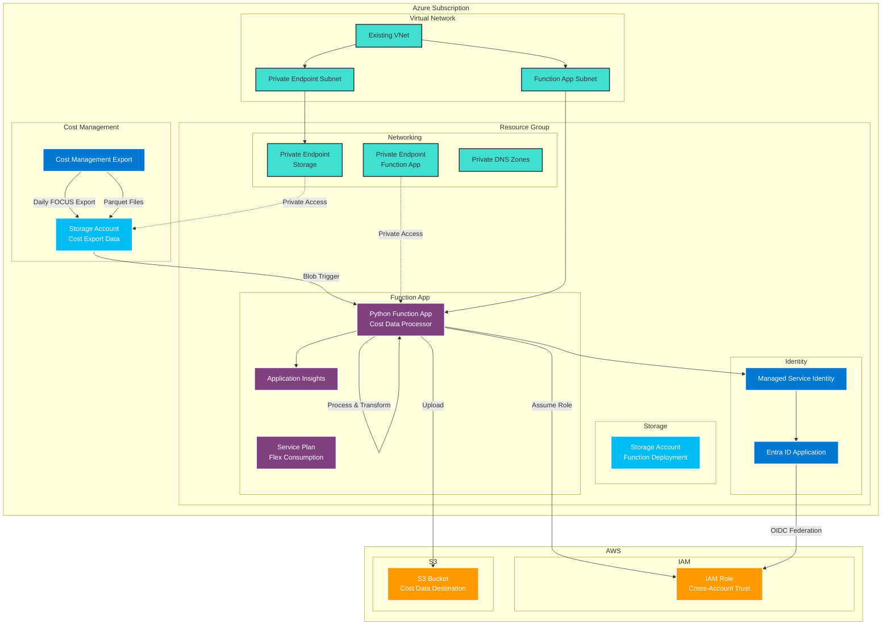
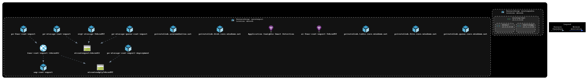

<!-- markdownlint-disable -->

<!-- markdownlint-restore -->
<!--
  ***** CAUTION: DO NOT EDIT ABOVE THIS LINE ******
-->


# terraform-azurerm-cost-forwarding

## Description

A Terraform module to export Azure cost data and forward to AWS.

> [!NOTE]  
> There is currently an [issue](https://github.com/hashicorp/terraform-provider-azurerm/issues/29993?source=post_page-----99ff43c1557f---------------------------------------) with publishing Function App code on the Flex Consumption Plan using a managed identity. We have had to revert to using the storage account connection string for now. More details can be found [here](https://medium.com/azure-terraformer/azure-functions-with-flex-consumption-and-managed-identity-is-broken-99ff43c1557f) (behind a paywall, sadly).

## Architecture

This module creates a fully integrated solution for exporting Azure cost data and forwarding it to AWS S3. The following diagram illustrates the data flow and component architecture:



### Data Flow

1. **Cost Export**: Azure Cost Management exports daily FOCUS-format cost data to Azure Storage
2. **Trigger**: Blob storage trigger activates the Python Function App when new cost data arrives
3. **Authentication**: Function App uses Managed Identity to authenticate with Entra ID Application
4. **Cross-Cloud Auth**: Entra ID Application uses OIDC federation to assume AWS IAM Role
5. **Data Transfer**: Function App downloads cost data from Azure Storage and uploads to AWS S3
6. **Monitoring**: Application Insights provides telemetry and monitoring for the entire process

### Security Features

- **Private Networking**: All components use private endpoints and VNet integration
- **Zero Trust**: No public network access (except during deployment if `deploy_from_external_network=true`)
- **Managed Identity**: Azure resources authenticate using system-assigned managed identities
- **Cross-Cloud Federation**: OIDC federation eliminates need for long-lived AWS credentials



## Usage

This example assumes you have an existing virtual network with two subnets, one of which has a delegation for Microsoft.App.environments:

```hcl
provider "azurerm" {
  resource_providers_to_register = ["Microsoft.CostManagementExports", "Microsoft.App"]
  features {}
}

module "example" {
  source                              = "git::https://github.com/appvia/terraform-azurerm-cost-forwarding?ref=33e484a0ac416c413a0273b9359abf4f77c5b06a" # release v0.0.3

  name                                = "terraform-azurerm-cost-forwarding"
  aws_target_file_path                = "s3://<your-s3-bucket>/<your-path>/"
  aws_role_arn                        = "arn:aws:iam::<aws-account-id>:role/<your-cost-export-role>"
  report_scope                        = "/providers/Microsoft.Billing/billingAccounts/<billing-account-id>:<billing-profile-id>_2019-05-31"
  subnet_id                           = "/subscriptions/<subscription-id>/resourceGroups/existing-infra/providers/Microsoft.Network/virtualNetworks/existing-vnet/subnets/default"
  function_app_subnet_id              = "/subscriptions/<subscription-id>/resourceGroups/existing-infra/providers/Microsoft.Network/virtualNetworks/existing-vnet/subnets/functionapp"
  virtual_network_name                = "existing-vnet"
  virtual_network_resource_group_name = "existing-infra"
  location                            = "uksouth"
  resource_group_name                 = "rg-cost-export"
  # Setting to false or omitting this argument assumes that you have private GitHub runners configured in the existing virtual network. It is not recommended to set this to true in production
  deploy_from_external_network        = false
}

output "aws_app_client_id" {
  description = "The aws app client id"
  value       = module.example.aws_app_client_id
}
```

Greenfield test deployment example:

```hcl
provider "azurerm" {
  resource_providers_to_register = ["Microsoft.CostManagementExports", "Microsoft.App"]
  features {}
}

locals {
  # Setting to true enables 'public' access to the Function App for the duration of the deployment. This is not recommended for production.
  deploy_from_external_network = true
}

variable "aws_target_file_path" {
  description = "AWS S3 path for cost export"
  type        = string
}

variable "aws_role_arn" {
  description = "AWS IAM role ARN for cross-account access"
  type        = string
}

variable "report_scope" {
  description = "Azure billing scope for cost reporting"
  type        = string
}

variable "existing_resource_group_name" {
  description = "Name of the existing resource group containing the VNet"
  type        = string
  default     = "existing-infra"
}

variable "existing_vnet_name" {
  description = "Name of the existing virtual network"
  type        = string
  default     = "existing-vnet"
}

variable "default_subnet_name" {
  description = "Name of the existing default subnet"
  type        = string
  default     = "default"
}

variable "functionapp_subnet_name" {
  description = "Name of the existing function app subnet"
  type        = string
  default     = "functionapp"
}

variable "location" {
  description = "Azure region for the cost forwarding resources"
  type        = string
  default     = "uksouth"
}

variable "resource_group_name" {
  description = "Name of the resource group to create for cost forwarding resources"
  type        = string
  default     = "rg-cost-export"
}

# Create the resource group for existing infrastructure
resource "azurerm_resource_group" "existing" {
  name     = var.existing_resource_group_name
  location = var.location
}

# Create the virtual network
resource "azurerm_virtual_network" "existing" {
  name                = var.existing_vnet_name
  address_space       = ["10.0.0.0/16"]
  location            = azurerm_resource_group.existing.location
  resource_group_name = azurerm_resource_group.existing.name
}

# Create the default subnet
resource "azurerm_subnet" "default" {
  name                 = var.default_subnet_name
  resource_group_name  = azurerm_resource_group.existing.name
  virtual_network_name = azurerm_virtual_network.existing.name
  address_prefixes     = ["10.0.0.0/24"]
}

# Create the function app subnet with delegation
resource "azurerm_subnet" "functionapp" {
  name                 = var.functionapp_subnet_name
  resource_group_name  = azurerm_resource_group.existing.name
  virtual_network_name = azurerm_virtual_network.existing.name
  address_prefixes     = ["10.0.1.0/24"]

  delegation {
    name = "Microsoft.App.environments"

    service_delegation {
      name    = "Microsoft.App/environments"
      actions = ["Microsoft.Network/virtualNetworks/subnets/action"]
    }
  }
}

# Call the cost forwarding module using the created resources
module "cost_forwarding" {
  source                              = "git::https://github.com/appvia/terraform-azurerm-cost-forwarding?ref=33e484a0ac416c413a0273b9359abf4f77c5b06a" # release v0.0.3

  name                                = "terraform-azurerm-cost-forwarding"
  aws_target_file_path                = var.aws_target_file_path
  aws_role_arn                        = var.aws_role_arn
  report_scope                        = var.report_scope
  subnet_id                           = azurerm_subnet.default.id
  function_app_subnet_id              = azurerm_subnet.functionapp.id
  virtual_network_name                = azurerm_virtual_network.existing.name
  virtual_network_resource_group_name = azurerm_resource_group.existing.name
  location                            = var.location
  resource_group_name                 = var.resource_group_name
  deploy_from_external_network        = local.deploy_from_external_network

  depends_on = [ azurerm_subnet.default, azurerm_subnet.functionapp ]
}

output "aws_app_client_id" {
  description = "The aws app client id"
  value       = module.cost_forwarding.aws_app_client_id
}
```

## Update Documentation

The `terraform-docs` utility is used to generate this README. Follow the below steps to update:

1. Make changes to the `.terraform-docs.yml` file
2. Fetch the `terraform-docs` binary (https://terraform-docs.io/user-guide/installation/)
3. Run `terraform-docs markdown table --output-file ${PWD}/README.md --output-mode inject .`

<!-- BEGIN_TF_DOCS -->
## Providers

| Name | Version |
|------|---------|
| <a name="provider_archive"></a> [archive](#provider\_archive) | >= 2.0 |
| <a name="provider_azapi"></a> [azapi](#provider\_azapi) | >= 1.7.0 |
| <a name="provider_azuread"></a> [azuread](#provider\_azuread) | > 2.0 |
| <a name="provider_azurerm"></a> [azurerm](#provider\_azurerm) | > 4.0 |
| <a name="provider_null"></a> [null](#provider\_null) | >= 3.0 |
| <a name="provider_random"></a> [random](#provider\_random) | >= 3.0 |
| <a name="provider_time"></a> [time](#provider\_time) | >= 0.7.0 |

## Inputs

| Name | Description | Type | Default | Required |
|------|-------------|------|---------|:--------:|
| <a name="input_aws_role_arn"></a> [aws\_role\_arn](#input\_aws\_role\_arn) | ARN of the AWS role to assume  Eg 'arn:aws:iam::000000000000:role/entra\_s3' | `string` | n/a | yes |
| <a name="input_aws_target_file_path"></a> [aws\_target\_file\_path](#input\_aws\_target\_file\_path) | S3 target file path Eg 's3://s3bucketname/folder/' | `string` | n/a | yes |
| <a name="input_function_app_subnet_id"></a> [function\_app\_subnet\_id](#input\_function\_app\_subnet\_id) | ID of the subnet to connect the function app to. This subnet must have delegation configured for Microsoft.App/environments and must be in the same virtual network as the private endpoints | `string` | n/a | yes |
| <a name="input_location"></a> [location](#input\_location) | The Azure region where resources will be created | `string` | n/a | yes |
| <a name="input_report_scope"></a> [report\_scope](#input\_report\_scope) | Scope of the cost report Eg '/providers/Microsoft.Billing/billingAccounts/00000000-0000-0000-0000-000000000000' | `string` | n/a | yes |
| <a name="input_resource_group_name"></a> [resource\_group\_name](#input\_resource\_group\_name) | Name of the new resource group | `string` | n/a | yes |
| <a name="input_subnet_id"></a> [subnet\_id](#input\_subnet\_id) | ID of the subnet to deploy the private endpoints to. Must be a subnet in the existing virtual network | `string` | n/a | yes |
| <a name="input_virtual_network_name"></a> [virtual\_network\_name](#input\_virtual\_network\_name) | Name of the existing virtual network | `string` | n/a | yes |
| <a name="input_virtual_network_resource_group_name"></a> [virtual\_network\_resource\_group\_name](#input\_virtual\_network\_resource\_group\_name) | Name of the existing resource group where the virtual network is located | `string` | n/a | yes |
| <a name="input_aws_region"></a> [aws\_region](#input\_aws\_region) | AWS region for the S3 bucket | `string` | `"eu-west-2"` | no |
| <a name="input_deploy_from_external_network"></a> [deploy\_from\_external\_network](#input\_deploy\_from\_external\_network) | If you don't have existing GitHub runners in the same virtual network, set this to true. This will enable 'public' access to the function app during deployment. This is added for convenience and is not recommended in production environments | `bool` | `false` | no |
| <a name="input_focus_dataset_version"></a> [focus\_dataset\_version](#input\_focus\_dataset\_version) | Version of the cost and usage details (FOCUS) dataset to use | `string` | `"1.0r2"` | no |
| <a name="input_name"></a> [name](#input\_name) | Name of the storage account | `string` | `"costexport"` | no |

## Outputs

| Name | Description |
|------|-------------|
| <a name="output_aws_app_client_id"></a> [aws\_app\_client\_id](#output\_aws\_app\_client\_id) | The aws app client id |
| <a name="output_carbon_container_name"></a> [carbon\_container\_name](#output\_carbon\_container\_name) | The storage container name for carbon data |
| <a name="output_carbon_export_name"></a> [carbon\_export\_name](#output\_carbon\_export\_name) | The name of the carbon optimization export |
| <a name="output_focus_container_name"></a> [focus\_container\_name](#output\_focus\_container\_name) | The storage container name for FOCUS cost data |
| <a name="output_focus_export_name"></a> [focus\_export\_name](#output\_focus\_export\_name) | The name of the FOCUS cost export |
| <a name="output_utilization_container_name"></a> [utilization\_container\_name](#output\_utilization\_container\_name) | The storage container name for utilization data |
| <a name="output_utilization_export_name"></a> [utilization\_export\_name](#output\_utilization\_export\_name) | The name of the cost utilization export |
<!-- END_TF_DOCS -->