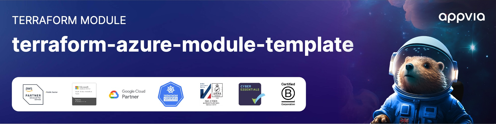
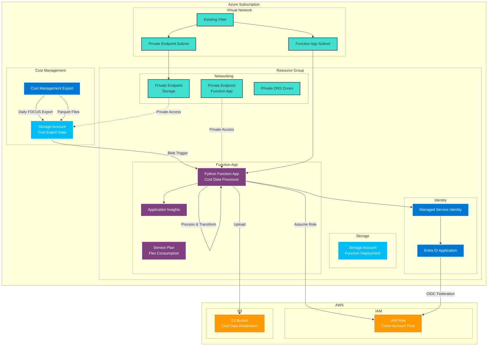

<!-- markdownlint-disable -->

<a href="https://www.appvia.io/"></a><br/><p align="right"> </a> <a href="https://github.com/appvia/terraform-azure-module-template/releases/latest"></a> <a href="https://appvia-community.slack.com/join/shared_invite/zt-1s7i7xy85-T155drryqU56emm09ojMVA#/shared-invite/email"></a> <a href="https://github.com/appvia/terraform-azure-module-template/graphs/contributors"></a>

<!-- markdownlint-restore -->
<!--
  ***** CAUTION: DO NOT EDIT ABOVE THIS LINE ******
-->


# terraform-azurerm-cost-forwarding

## Description

A Terraform module to export Azure cost data and forward to AWS.

> [!NOTE]  
> There is currently an [issue](https://github.com/hashicorp/terraform-provider-azurerm/issues/29993?source=post_page-----99ff43c1557f---------------------------------------) with publishing Function App code on the Flex Consumption Plan using a managed identity. We have had to revert to using the storage account connection string for now. More details can be found [here](https://medium.com/azure-terraformer/azure-functions-with-flex-consumption-and-managed-identity-is-broken-99ff43c1557f) (behind a paywall, sadly).

## Architecture

This module creates a fully integrated solution for exporting Azure cost data and forwarding it to AWS S3. The following diagram illustrates the data flow and component architecture:



Azure Resource Topology Diagram:

[azure diagram](./images/infra.png)

### Data Flow

1. **Cost Export**: Azure Cost Management exports daily FOCUS-format cost data to Azure Storage
2. **Trigger**: Blob storage trigger activates the Python Function App when new cost data arrives
3. **Authentication**: Function App uses Managed Identity to authenticate with Entra ID Application
4. **Cross-Cloud Auth**: Entra ID Application uses OIDC federation to assume AWS IAM Role
5. **Data Transfer**: Function App downloads cost data from Azure Storage and uploads to AWS S3
6. **Monitoring**: Application Insights provides telemetry and monitoring for the entire process

### Security Features

- **Private Networking**: All components use private endpoints and VNet integration
- **Zero Trust**: No public network access (except during deployment if `deploy_from_external_network=true`)
- **Managed Identity**: Azure resources authenticate using system-assigned managed identities
- **Cross-Cloud Federation**: OIDC federation eliminates need for long-lived AWS credentials

## Usage

Add example usage here

```hcl
module "example" {
  source  = "appvia/<NAME>/azure"
  version = "0.0.1"

  # insert variables here
}
```

## Update Documentation

The `terraform-docs` utility is used to generate this README. Follow the below steps to update:

1. Make changes to the `.terraform-docs.yml` file
2. Fetch the `terraform-docs` binary (https://terraform-docs.io/user-guide/installation/)
3. Run `terraform-docs markdown table --output-file ${PWD}/README.md --output-mode inject .`

<!-- BEGIN_TF_DOCS -->
## Providers

| Name | Version |
|------|---------|
| <a name="provider_archive"></a> [archive](#provider\_archive) | >= 2.0 |
| <a name="provider_azapi"></a> [azapi](#provider\_azapi) | >= 1.7.0 |
| <a name="provider_azuread"></a> [azuread](#provider\_azuread) | > 2.0 |
| <a name="provider_azurerm"></a> [azurerm](#provider\_azurerm) | > 4.0 |
| <a name="provider_null"></a> [null](#provider\_null) | >= 3.0 |
| <a name="provider_random"></a> [random](#provider\_random) | >= 3.0 |
| <a name="provider_time"></a> [time](#provider\_time) | >= 0.7.0 |

## Inputs

| Name | Description | Type | Default | Required |
|------|-------------|------|---------|:--------:|
| <a name="input_aws_role_arn"></a> [aws\_role\_arn](#input\_aws\_role\_arn) | ARN of the AWS role to assume  Eg 'arn:aws:iam::000000000000:role/entra\_s3' | `string` | n/a | yes |
| <a name="input_aws_target_file_path"></a> [aws\_target\_file\_path](#input\_aws\_target\_file\_path) | S3 target file path Eg 's3://s3bucketname/folder/' | `string` | n/a | yes |
| <a name="input_function_app_subnet_id"></a> [function\_app\_subnet\_id](#input\_function\_app\_subnet\_id) | ID of the subnet to connect the function app to. This subnet must have delegation configured for Microsoft.App/environments and must be in the same virtual network as the private endpoints | `string` | n/a | yes |
| <a name="input_location"></a> [location](#input\_location) | The Azure region where resources will be created | `string` | n/a | yes |
| <a name="input_report_scope"></a> [report\_scope](#input\_report\_scope) | Scope of the cost report Eg '/providers/Microsoft.Billing/billingAccounts/00000000-0000-0000-0000-000000000000' | `string` | n/a | yes |
| <a name="input_resource_group_name"></a> [resource\_group\_name](#input\_resource\_group\_name) | Name of the new resource group | `string` | n/a | yes |
| <a name="input_subnet_id"></a> [subnet\_id](#input\_subnet\_id) | ID of the subnet to deploy the private endpoints to. Must be a subnet in the existing virtual network | `string` | n/a | yes |
| <a name="input_virtual_network_name"></a> [virtual\_network\_name](#input\_virtual\_network\_name) | Name of the existing virtual network | `string` | n/a | yes |
| <a name="input_virtual_network_resource_group_name"></a> [virtual\_network\_resource\_group\_name](#input\_virtual\_network\_resource\_group\_name) | Name of the existing resource group where the virtual network is located | `string` | n/a | yes |
| <a name="input_aws_region"></a> [aws\_region](#input\_aws\_region) | AWS region for the S3 bucket | `string` | `"eu-west-2"` | no |
| <a name="input_deploy_from_external_network"></a> [deploy\_from\_external\_network](#input\_deploy\_from\_external\_network) | If you don't have existing GitHub runners in the same virtual network, set this to true. This will enable 'public' access to the function app during deployment. This is added for convenience and is not recommended in production environments | `bool` | `false` | no |
| <a name="input_name"></a> [name](#input\_name) | Name of the storage account | `string` | `"costexport"` | no |

## Outputs

| Name | Description |
|------|-------------|
| <a name="output_aws_app_client_id"></a> [aws\_app\_client\_id](#output\_aws\_app\_client\_id) | The aws app client id |
<!-- END_TF_DOCS -->