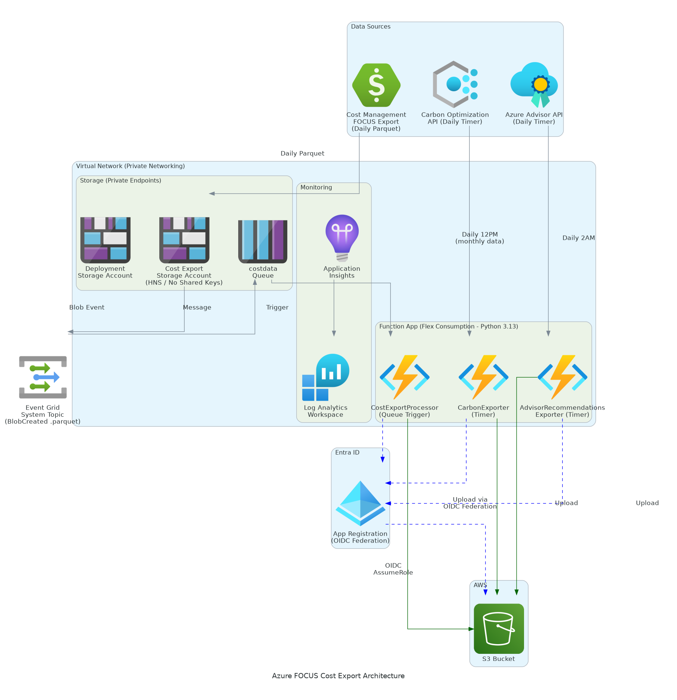

# terraform-azure-focus

<!-- markdownlint-disable -->

<!-- markdownlint-restore -->
<!--
  ***** CAUTION: DO NOT EDIT ABOVE THIS LINE ******
-->


## Description

This Terraform module exports Azure cost data and writes it to a configured AWS S3 bucket. Supported data sets are described below:

- **Cost Data**: Daily parquet files containing standardised cost and usage
  details in FOCUS format
- **Azure Advisor Recommendations**: Daily JSON files containing cost
  optimisation recommendations from Azure Advisor
- **Carbon Emissions Data**: Monthly JSON reports with carbon footprint
  metrics across Scope 1 and Scope 3 emissions

For a full inventory of deployed resources and pricing considerations, see the
[Bill of Materials](BILL_OF_MATERIALS.md).

## Architecture

This module creates a fully integrated solution for exporting multiple cost-related
datasets from Azure and forwarding them to AWS S3. The following diagram illustrates the
data flow and component architecture for all three export types:



## Prerequisites

- An existing virtual network with two subnets, one of which has a delegation
  for `Microsoft.App.environments` (`function_app_subnet_id`).
- [PowerShell 7 (`pwsh`)](https://learn.microsoft.com/en-us/powershell/scripting/install/installing-powershell)
  on the machine that runs `terraform apply`/`terraform destroy`. Note that all GitHub runner images include the current LTS release by default.
- [Deployment privileges](#a-deployment-privileges), granted to the principal that runs
  `terraform apply`.
- [Billing account access](#billing-account-setup) - read the billing account section before deploying, especially for EA customers.

<a name="billing-account-setup"></a>

## Billing Account Setup

> [!IMPORTANT]
> Billing account configuration is the most common source of deployment and backfill failures. Read this section in full before running `terraform apply`.

### Finding your billing account ID

Billing account IDs are found in the [Azure portal](https://portal.azure.com) under **Cost Management + Billing → Billing scopes**. They are not the same as subscription or tenant IDs.

The format differs by agreement type:

| Agreement type | ID format example |
|---|---|
| Microsoft Customer Agreement (MCA) | `<billing-account-guid>:<billing-profile-guid>_YYYY-MM-DD` |
| Enterprise Agreement (EA) | `<enrollment-number>` (numeric) |

Pass the ID(s) as the `billing_account_ids` input and set `is_enterprise_customer = true` if you are on EA.

> [!TIP]
> **Who owns the billing account?** Billing account administrators are often in a different team from the platform/infrastructure team running Terraform - typically Finance, FinOps, or a central IT cost-management team. Identify this person early: the deploying service principal needs billing account permissions to create the daily cost export during `terraform apply`, and the function app's managed identity needs them to run exports and backfill after deployment. Without the right billing permissions, `terraform apply` itself will fail - not just the post-deploy function behaviour.

### Microsoft Customer Agreement (MCA)

The deploying service principal needs **Billing account owner** on the billing account (see [a)](#a-deployment-privileges)). With that role in place, the module:

1. Creates the daily FOCUS cost export at billing-account scope.
2. Assigns `Billing account reader` to the function app's managed identity automatically at apply time.

No manual post-deploy step is required for MCA.

### Enterprise Agreement (EA)

> [!CAUTION]
> **EA customers: a manual step is required after every `terraform apply` - the function app cannot create or run backfill exports until it is done.**
>
> The module cannot perform this step itself: assigning billing roles for EA requires **Enterprise Administrator** privileges in the Azure EA portal, which are entirely separate from Azure RBAC. Role assignments for service principals may not appear in the Azure portal.

#### Step 1 - `terraform apply`

The deploying principal needs **EnrollmentReader** on the EA billing account (see [a)](#a-deployment-privileges)). This is sufficient to create the FOCUS export schedule, but the function app's managed identity still cannot run the exports yet.

#### Step 2 - Assign EnrollmentReader to the function identity

After every `terraform apply`, an Enterprise Administrator must run [`scripts/NewBillingRoleAssignment.ps1`](scripts/NewBillingRoleAssignment.ps1) for each EA billing account. The `cost_export_app_principal_id` and `tenant_id` outputs provide the values you need.

```pwsh
# Run once per billing account after every terraform apply.
# Values come from the terraform output:
#   cost_export_app_principal_id  → ServicePrincipalObjectID
#   tenant_id                     → (used to find billing account)
./scripts/NewBillingRoleAssignment.ps1 `
  -BillingAccountID        <billing account id> `
  -ServicePrincipalObjectID <object id from cost_export_app_principal_id output> `
  -RoleDefinitionID        '24f8edb6-1668-4659-b5e2-40bb5f3a7d7e' `
  -IsEnterpriseAgreement
```

**Why is this step easy to miss?**

- The script must be re-run any time the function app's managed identity is recreated (e.g. after a `terraform destroy` / re-deploy).
- The assignment may not appear in the Azure portal
- Without it, the function app's `CostExportBackfill` and `CostExportProcessor` functions will fail.

See the [Backfill](#backfill) section for what to expect once this step is complete.

<a name="privileges"></a>

## RBAC

This section is split into a) what the deploying
principal must already hold and b) what roles the module assigns at apply time.
Permissions are least-privilege by design, scoped as narrowly as Azure allows.

### a) Deployment privileges

The principal running `terraform apply` (`current_principal_type` = `User` or
`ServicePrincipal`) needs at least the following. Note that the module grants the deployment principal the
data plane roles it needs during apply (see (b)), so those are *not*
prerequisites - unless `manage_role_assignments = false`.

| Scope | Role | Why it is needed |
|---|---|---|
| Subscription (where resources are created) | **Contributor** | To create all, or a subset of the following resources: resource group, storage accounts, function app, Event Grid, private endpoints, private DNS, Log Analytics Workspace and the user-assigned identity. |
| Subscription | **User Access Administrator** | Create the resource-group / storage-account-scoped role assignments the module defines, including the ABAC-constrained `Owner` grant. |
| Tenant Root management group, or `management_group_id` | **User Access Administrator*** | Assign `Carbon Optimization Reader` and `Advisor Recommendations Contributor` to the function identity. |
| Billing account - **MCA** | **Billing account owner** | Create the daily FOCUS export at billing-account scope **and** assign the `Billing account reader` billing role to the function identity. |
| Billing account - **EA** | **EnrollmentReader** | Create the daily FOCUS export. The function identity's billing role must be assigned manually - see the [important alert](#ea-billing-role-script) below. |

> [!TIP]
> *The management-group `User Access Administrator` only manages RBAC for the
> function identity at the Tenant Root Group, so it should be constrained.
> `User Access Administrator` grants the full `Microsoft.Authorization/*` action
> set - including the ability to assign **any** role - so on its own it is a
> privilege-escalation path. Lock it down with an Azure **ABAC condition** on the
> role assignment.
>
> In the portal: **Tenant Root Group → Access control (IAM) → the deployment
> service principal's `User Access Administrator` assignment → View/Edit →
> Configure** (under 'Constrain roles'), then add the two built-in roles the
> module assigns:
>
> - `Carbon Optimization Reader`
> - `Advisor Recommendations Contributor`

### b) Privileges assigned by the module

The module uses a **user-assigned managed identity** for the function app ('function identity' below) and **system-assigned** identities for the Event Grid
system topic and for each Cost Management export.

> [!NOTE]
> Every grant in the table below is created only when `manage_role_assignments`
> is `true` (the default). Set it to `false` if RBAC is owned by a separate
> team/process: the module then creates **none** of these assignments and you
> must pre-provision every one yourself - **including the deploying principal's
> `Storage Blob Data Contributor` and `Storage Queue Data Contributor` roles**,
> without which `terraform apply` fails when the provider reads the cost-export
> storage account over Entra ID. The Entra `AssumeRoleWithWebIdentity` app-role
> assignment is governed separately by `manage_entra_app_role_assignment` (default
> `true`), so by default it is still created here - see
> [Separation of duties](#c-separation-of-duties-bring-your-own-entra-app-registration) below.

| Principal | Role | Scope | Purpose |
|---|---|---|---|
| Deploying principal | Storage Blob Data Contributor | cost-export resource group | Apply-time only: the azurerm provider reads the storage account's blob properties over Entra ID. |
| Deploying principal | Storage Queue Data Contributor | cost-export resource group | Apply-time only: the provider also reads queue properties. |
| Function identity | Storage Blob Data Contributor | cost-export storage account | Write export output and create export tasks that deliver to this account. |
| Function identity | Storage Queue Data Contributor | cost-export storage account | Read the queue that triggers the `CostExportProcessor`. |
| Function identity | `Owner` (ABAC-constrained) | cost-export storage account | Allows Cost Management to assign `Storage Blob Data Contributor` to each export's own identity. The condition restricts the function to assigning/removing **only** that role - no privilege escalation. For more information, see [Cost Management export prerequisites](https://learn.microsoft.com/en-us/azure/cost-management-billing/costs/tutorial-improved-exports#prerequisites) (the proposed custom role is not in fact sufficient and includes `Microsoft.Authorization/roleAssignments/write` anyway). |
| Function identity | Storage Blob Data Contributor | deployment storage account | Flex Consumption host storage: the host mounts the deployment package and manages its own blob leases/locks with the app identity (shared keys are disabled on this account). Without it the app is unhealthy after a successful zip deploy. |
| Function identity | Storage Queue Data Contributor | deployment storage account | Flex Consumption host storage: the host's queue singleton / timer leases. |
| Function identity | Carbon Optimization Reader (built-in) | Tenant Root management group, or `management_group_id` | `CarbonEmissionsExporter` reads carbon data across the subscriptions in scope. |
| Function identity | Advisor Recommendations Contributor | Tenant Root management group, or `management_group_id` | `AdvisorRecommendationsExporter` reads Advisor recommendations across the subscriptions in scope. Least-privilege built-in for this - see note below. |
| Function identity | Billing account reader | MCA Billing account(s) (if any) | Enumerate subscriptions and create/run FOCUS cost exports. |
| Event Grid system topic identity | Storage Queue Data Message Sender | cost-export storage account | Deliver blob-created events into the storage queue. |
| Function identity | `AssumeRoleWithWebIdentity` app role | AWS-federation Entra application | OIDC federation to assume the AWS IAM role (no long-lived AWS credentials). |

<a id="ea-billing-role-script"></a>

> [!CAUTION]
> **EA customers: a manual post-deploy step is required.** See [Billing Account Setup - EA](#enterprise-agreement-ea) for the full instructions and the `NewBillingRoleAssignment.ps1` script. Without this step the function app cannot create or run backfill exports.

#### Why these specific grants

- **Storage data-plane roles (deployer and function).** The cost-export storage
  account disables shared access keys, so the provider authenticates to its data
  plane with Entra ID (`storage_use_azuread = true`). On create and refresh the
  provider reads **both** blob and queue service properties; without the queue
  role the read fails and the provider surfaces a misleading
  `KeyBasedAuthenticationNotPermitted` (403) - see
  [terraform-provider-azurerm#29984](https://github.com/hashicorp/terraform-provider-azurerm/issues/29984).
  The deployer grants are scoped to the resource group and have a short
  propagation delay before the storage account is created.
- **Constrained `Owner` for the function.** When creating an export to a
  firewall-protected storage account, Cost Management validates that the caller
  can access the destination and then assigns `Storage Blob Data Contributor` to
  the export's own managed identity. Narrower grants (a custom "authorization
  actions only" role, Storage Account Contributor, or the data-plane blob roles)
  fail at create time with `401 "User is not authorized to access the specified
  storage account"` - `Owner` is what Cost Management actually requires (see this
  [Microsoft Q&A](https://learn.microsoft.com/en-us/answers/questions/5830148/cross-subscription-export-fails-due-to-storage-acc)).
  Because `Owner` is broad, it is constrained with an ABAC condition so the
  function identity may only assign or remove the `Storage Blob Data Contributor`
  role on this account - every other `Owner` action is allowed, but it cannot use
  `roleAssignments/write` to grant arbitrary roles.
- **Advisor read role.** Azure Advisor RBAC-trims recommendations to scopes the
  caller can read: without a read role the recommendations API returns `200` with
  an empty array (never `403`), so the exporter silently finds nothing. The
  exporter only reads, but there is **no read-only built-in** for Advisor
  recommendations - `Advisor Recommendations Contributor`
  (`recommendations/read` + `write` + `available/action`) is the least-privilege
  built-in that includes the read action, and it avoids maintaining a custom role.
- **Billing roles.** For MCA the `Billing account reader` role is assigned to the
  function identity automatically.

### c) Separation of duties: bring your own Entra app registration

By default the module creates the AWS-federation Entra app registration, its
service principal, and its `AssumeRoleWithWebIdentity` app role. Creating these
requires **directory-write** privileges (e.g. `Application Administrator` /
`Cloud Application Administrator`), so the deploying principal would need both
Azure RBAC rights **and** Entra ID app-management rights.

If your organisation separates Entra ID administration from Azure RBAC
administration, your Entra team can pre-create the app registration out-of-band
and you point the module at it - the deploying principal then needs no
directory-write privilege.

**Configuring the existing app registration:**

In both modes below, your Entra team must run
`scripts/ConfigureExistingAppRegistration.ps1` (bundled with this module) to
ensure the app role, identifier URI, and app role assignment are configured. The
script is idempotent - safe to re-run at any time. If you set `cost_mgmt_suffix`
in your module configuration, pass `-CostManagementSuffix` to the script as well.

The `entra_app_role_assignment_manual_action_required`
[output](#output_entra_app_role_assignment_manual_action_required) prints the
exact command after apply.

**Module inputs:**

| Variable | Effect |
|---|---|
| `existing_entra_application_client_id` | Client (application) ID of the pre-created app. When set, the module does **not** create the app / service principal / app role and consumes this ID instead. |
| `manage_entra_app_role_assignment` | Whether the module creates the app-role binding (function identity → `AssumeRoleWithWebIdentity`). Default `true`. **Only takes effect when `existing_entra_application_client_id` is set**; when the module creates the app registration it already holds directory-write, so this is forced `true` and the binding is always created. |

**Two modes for the app-role binding, both assuming you have supplied
`existing_entra_application_client_id`** (the binding depends on the module-created
function managed identity, so it cannot be fully pre-created):

- `manage_entra_app_role_assignment = true` (default): the module still creates the
  binding. With a bring-your-own app it resolves the app's service principal via a
  directory **read** (`data.azuread_service_principal`), so the deploying principal
  needs `AppRoleAssignment.ReadWrite.All` or ownership of that one service principal -
  a far narrower grant than tenant-wide app management. The script must still be run
  beforehand to ensure the app role and identifier URI exist.
- `manage_entra_app_role_assignment = false` (strict separation): the module performs
  **no** Entra writes or reads at all. The script handles everything - app role,
  identifier URI, and the app role assignment. The function cannot authenticate to
  AWS until this is done.

### d) CI/CD: separate plan and apply service principals

Pipelines such as the [Azure Landing Zones Terraform Accelerator](https://azure.github.io/Azure-Landing-Zones/accelerator/) use two distinct service principals (or user-assigned managed identities with workload identity federation) so that `terraform plan` can run automatically on every pull request without granting write permissions to that workflow:

- **Plan principal** - read-only; runs on every PR to produce a plan for review.
- **Apply principal** - write-capable; runs only on merge to the protected branch, ideally behind a manual approval gate.

#### Plan principal - minimum roles

`terraform plan` reads existing state (refresh pass) and resolves data sources but creates nothing and assigns no roles. The roles below are the read-only counterparts of the apply principal's requirements from [a) Deployment privileges](#a-deployment-privileges).

| Scope | Role | Why it is needed |
|---|---|---|
| Subscription (where resources are created) | **Reader** | Refresh all existing resources (resource group, storage accounts, function app, Event Grid, private endpoints, private DNS, Log Analytics Workspace, user-assigned identity). |
| Cost-export resource group | **Storage Blob Data Reader** | The `azurerm` provider authenticates to the cost-export storage account over Entra ID during state refresh - same underlying reason the apply principal needs `Storage Blob Data Contributor` (see [why these specific grants](#why-these-specific-grants)). |
| Cost-export resource group | **Storage Queue Data Reader** | Provider reads queue service properties on refresh. Without it the read fails with a misleading `KeyBasedAuthenticationNotPermitted` (403). |
| Tenant Root management group, or `management_group_id` | **Reader** | Resolves the `azurerm_management_group` data source used to scope the carbon and Advisor feeds. |
| Billing account - **MCA** | **Billing account reader** | Reads the billing account and export configuration. |
| Billing account - **EA** | **EnrollmentReader** | Same for EA customers. |

> [!NOTE]
> The two storage data-plane reader roles are only required after the **first** `terraform apply` - before that the storage account does not exist and there is nothing to refresh. They become necessary from the second plan run onwards.

#### Apply principal - minimum roles

Use the full set from [a) Deployment privileges](#a-deployment-privileges). The module automatically grants the apply principal `Storage Blob Data Contributor` and `Storage Queue Data Contributor` at apply time, so those are not prerequisites unless `manage_role_assignments = false`.

#### Terraform state backend

Both principals need access to the remote state. If your state is stored in Azure Blob Storage the typical grants are:

| Principal | Role | Scope |
|---|---|---|
| Plan principal | **Storage Blob Data Reader** | State container (if using `terraform plan -lock=false`) **or** `Storage Blob Data Contributor` to acquire a state lock |
| Apply principal | **Storage Blob Data Contributor** | State container |

Using `-lock=false` on the plan job and `Storage Blob Data Reader` is the least-privilege option; it does carry a small risk of a stale plan if state changes between plan and apply.

## Security Features

- **Private Networking**: All components use private endpoints and VNet
  integration
- **Zero Trust**: No public network access (except during deployment if
  `deploy_from_external_network=true`)
- **Managed Identity**: Azure resources authenticate using managed identities
- **Cross-Cloud Federation**: OIDC federation eliminates need for long-lived
  AWS credentials
- **Hash-Pinned Dependencies**: Python packages in `requirements.txt` are pinned to exact versions with SHA256 hashes, ensuring artifact integrity and protecting against supply-chain attacks

## Usage

```hcl
provider "azurerm" {
  # These need to be explicitly registered
  resource_providers_to_register = ["Microsoft.CostManagementExports", "Microsoft.App"]
  storage_use_azuread = true
  features {}
}

module "cost_forwarding" {
  source = "git::https://github.com/co-cddo/terraform-azure-focus?ref=0ea5860ee95c00717e908562a0ec5fe6fb6822cd" # v4.0.0

  aws_s3_bucket_name                  = "<aws s3 bucket name>"
  aws_account_id                      = "<aws account id>"
  billing_account_ids                 = ["<billing account id>"] # List of billing account IDs (applicable to FOCUS cost data only)
  subnet_id                           = "<resource id for existing subnet to be used for private endpoints>"
  function_app_subnet_id              = "<resource id for existing subnet to be used for function app vnet integration>"
  virtual_network_name                = "<name of the existing virtual network containing the two subnets above>"
  virtual_network_resource_group_name = "<name of the existing resource group containing the virtual network above>"

  ## Set to false if you do not have Enterprise Agreement (EA) billing account(s) (i.e. you have Microsoft Customer Agreement (MCA) billing account(s))
  ## You must also manually grant the managed identity for the function app 'Enrolment Reader' on EA account(s) following deployment - see scripts/NewBillingRoleAssignment.ps1
  is_enterprise_customer             = true

  ## Uncomment when running in CI/CD with a service principal (e.g., GitHub Actions)
  # current_principal_type = "ServicePrincipal"
}
```

> [!TIP]
> If you don't have a suitable existing Virtual Network with two subnets
> (one of which has a delegation to Microsoft.App.environments), please
> refer to the example configuration [here](examples/greenfield),
> which provisions the prerequisite baseline infrastructure before consuming
> the module.

## Private DNS Configuration

This module supports three private DNS modes for private endpoints:

1. Module-managed DNS (default)
   - `private_endpoints_manage_dns_zone_group = true`
   - `use_existing_private_dns_zones = false`
   - Module creates and manages private DNS zones, links, and A records.
2. Bring-your-own zones (BYOD)
   - `private_endpoints_manage_dns_zone_group = true`
   - `use_existing_private_dns_zones = true`
   - Provide `existing_private_dns_zone_ids` for `blob`, `queue`, and `sites`.
   - Best suited when DNS zones are in the same subscription context as the module provider.
3. External DNS management (for example Azure Policy)
   - `private_endpoints_manage_dns_zone_group = false`
   - Module creates private endpoints but does not manage private DNS zones, links, or A records.
   - Recommended for ALZ-style cross-subscription DNS architectures.

### BYOD Example

```hcl
module "example" {
  source = "git::https://github.com/co-cddo/terraform-azure-focus?ref=<release commit SHA>" # v<release version number>

  private_endpoints_manage_dns_zone_group = true
  use_existing_private_dns_zones          = true

  existing_private_dns_zone_ids = {
    blob  = "/subscriptions/00000000-0000-0000-0000-000000000000/resourceGroups/rg-network/providers/Microsoft.Network/privateDnsZones/privatelink.blob.core.windows.net"
    queue = "/subscriptions/00000000-0000-0000-0000-000000000000/resourceGroups/rg-network/providers/Microsoft.Network/privateDnsZones/privatelink.queue.core.windows.net"
    sites = "/subscriptions/00000000-0000-0000-0000-000000000000/resourceGroups/rg-network/providers/Microsoft.Network/privateDnsZones/privatelink.azurewebsites.net"
  }
...
```

### External DNS Management Example

```hcl
module "example" {
  source = "git::https://github.com/co-cddo/terraform-azure-focus?ref=<release commit SHA>" # v<release version number>

  private_endpoints_manage_dns_zone_group = false
...
```

> [!NOTE]
> This module no longer manages `azurerm_private_dns_a_record` resources; when `private_endpoints_manage_dns_zone_group = true` DNS records are created automatically via the private DNS zone group on each private endpoint.

## Multiple Azure Tenants

If multiple instances of the solution are required across different Azure tenants associated with the same billing account; FOCUS/cost exports should only be enabled in the primary tenant. Cost exports are scoped at the billing account level, so creating them in more than one tenant in this scenario would produce duplicate data.

Set `enable_focus_exports = false` on all secondary tenant deployments. The Function App, Carbon Emissions Data, and Azure Advisor Recommendations pipelines will still be deployed and operate normally; only the FOCUS/cost export infrastructure (storage account, Event Grid, daily schedule, billing role assignments, and backfill) are skipped. CostExportProcessor and CostExportBackfill functions will still be published but in a disabled state.

### Example: Primary tenant (creates exports)

```hcl
module "cost_forwarding" {
  source = "git::https://github.com/co-cddo/terraform-azure-focus?ref=<release commit SHA>"

  billing_account_ids = ["bdfa614c-3bed-5e6d-313b-b4bfa3cefe1d:16e4ddda-0100-468b-a32c-abbfc29019d8_2019-05-31"]

  # ... other required variables
}
```

### Example: Secondary tenant (same billing account, exports disabled)

```hcl
module "cost_forwarding" {
  source = "git::https://github.com/co-cddo/terraform-azure-focus?ref=<release commit SHA>"

  enable_focus_exports = false
  billing_account_ids  = []

  # ... other required variables
}
```

> [!NOTE]
> When `enable_focus_exports = false`, cost-export-specific outputs (`focus_container_name`, `cost_export_storage_account_name`, `cost_export_storage_account_id`, `event_grid_system_topic_name`, `event_grid_subscription_name`, `storage_private_endpoint_ip`, `storage_queue_private_endpoint_ip`) return `null`.

## Data Flow

The module creates three distinct export pipelines for each of the data sets:

### FOCUS Cost Data Pipeline

1. **Daily Export**: Cost Management exports daily FOCUS-format cost data
   (Parquet files) to Azure Storage
2. **Event Trigger**: Blob creation events trigger the `CostExportProcessor`
   function via storage queue
3. **Processing**: Function processes and transforms the data (removes
   sensitive columns, restructures paths)
4. **Upload**: Processed data uploaded to S3 in partitioned structure:
   `billing_period=YYYYMMDD/`; all billing account cost data written to the
   same folder each parquet object prefixed with the billing account name

### Azure Advisor Recommendations Pipeline

1. **Daily Trigger**: `AdvisorRecommendationsExporter` function runs daily at
   2 AM (timer trigger)
2. **API Call**: Function calls Azure Advisor Recommendations API for all
   subscriptions in scope, filtering for cost category recommendations
3. **Processing**: Response data formatted as JSON with subscription tracking
   and date metadata
4. **Upload**: JSON data uploaded to S3 in partitioned structure:
   `gds-recommendations-v1/billing_period=YYYYMMDD/`

### Carbon Emissions Pipeline

- **Monthly Trigger**: `CarbonEmissionsExporter` function runs every day to
  download the latest data as soon as it becomes available (around the 19th
  of each month)
  - API Call: Function calls Azure Carbon API against
    `MonthlySummaryReport` for previous month's Scope 1 & 3 emissions
    - Batches the API call per 100 subscriptions, and merges all each of the
      datasets into one - refer to "subscription batching" below.
  - Processing: Response data formatted as JSON with dynamic date range
    validation (12-month rolling window)
  - Upload: JSON data uploaded to S3 in partitioned structure:
    `billing_period=YYYYMMDD/`

The Carbon API provides a rolling 12-month window of emissions
data. The available date range is calculated dynamically based on Microsoft's
data availability policy:

- **Data Availability**: Previous month's data becomes available by the 19th
  of the current month
- **Rolling Window**: API provides access to exactly 12 months of historical
  data
- **Dynamic Calculation**: Date ranges are recalculated on each function
  execution (no hard-coded dates)
- **Automatic Adjustment**: Functions automatically use the most recent
  available data within the API's current range

**Example**: On October 30, 2024 (day ≥19), the API would provide data for
September 2024. The same function running on January 15, 2025 would provide
data for November 2024.

A test endpoint is available at `/api/carbon-date-range` to view the current
calculated date range.

### Carbon API Subscription Batching

The Carbon API has a maximum limit of 100 subscriptions per
request. The functions automatically handle large subscription lists through
intelligent batching:

- **Automatic Batching**: Subscription lists >100 are automatically split into
  batches of 100 or fewer
- **Result Merging**: Responses from multiple batches are seamlessly merged
  into a single result
- **Error Handling**: Partial failures are handled gracefully - successful
  batches are preserved even if some fail
- **Transparent Operation**: Batching is completely transparent to users and
  maintains all existing functionality
- **Enhanced Logging**: Detailed logs show batch progress and any issues

**Example**: For 131 subscriptions (like GDS), the system automatically:

1. Creates 2 batches: 100 + 31 subscriptions
2. Makes 2 separate API calls
3. Merges the results automatically
4. Provides complete data as if from a single request

- Function Apps use Managed Identity to authenticate with Entra ID
  Application
- Entra ID Application uses OIDC federation to assume AWS IAM Role
- All data transfers secured with cross-cloud federation (no long-lived AWS
  credentials)
- Application Insights provides telemetry and monitoring for all pipelines

## Backfill

> [!NOTE]
> **EA customers:** the function app cannot create or run any backfill exports until the post-deploy `EnrollmentReader` assignment has been made. See [Billing Account Setup - EA](#enterprise-agreement-ea) before troubleshooting backfill failures.

### FOCUS Cost Data

**Endpoint**: `POST /api/cost-export-backfill`

Can be called on-demand with a mandatory query parameter `start_date` in the
format YYYY-MM-DD.

The cost export has two separate lock files; one for the schedule (which
creates the backfill of Cost Mgmt Export tasks for each month) and the run
(the executing of those exports) - in batches of six (half year). Lock
objects are created only after successfully creating the schedule or once a
full run across all tasks has completed successfully.

To run the full backfill of tasks, simply repeatedly run this cost export
backfill task. If a task is already running, it will not interrupt the
running task but it will count as one of the batch of six. It takes around
15 minutes for each task to run - and will run concurrently.

The schedule will be created from the given backfill start date for every
month up to until last month.

To remove the lock object, contact appvia support.

**Query Parameters**:

- `start_date` - the backfill start date in format YYYY-MM-DD
  (e.g. 2025-01-01); no default must be given
- `force_overwrite=true` - Overwrite existing data files (default: false); set
  `skip_existing` to False
- `skip_existing=false` - Process all months regardless of existing data
  (default: true)

**Examples**:

- `POST /api/cost-export-backfill` - Skip months that already have data
  (idempotent)
- `POST /api/cost-export-backfill?force_overwrite=true` - Overwrite all
  existing data
- `POST /api/cost-export-backfill?skip_existing=false` - Process all months,
  but don't skip if carbon export already exists

### Carbon Emissions Data

**Endpoint**: `POST /api/carbon-backfill`

Can be called on-demand with a mandatory query parameter `start_date` in the
format YYYY-MM-DD, called the same API as the monthly trigger but for each
month from the given start date.

Uses a "carbon export" lock object on the target S3 bucket as semaphore; the
lock object exists then Carbon data backfill is skipped. Lock object is
created only once a full carbon export backfill has completed successfully.

The Carbon Mgmt API only provides up to 12 months of archive data; where the
backfill start date precedes the 12 months it will write an empty file. The
backfill will run from start date up until the month prior to current Carbon
Export (note the 19th of the month - see above).

To remove the lock object, contact appvia support.

**Query Parameters**:

- `start_date` - the backfill start date in format YYYY-MM-DD
  (e.g. 2025-01-01); no default must be given
- `force_overwrite=true` - Overwrite existing data files (default: false); set
  `skip_existing` to False
- `skip_existing=false` - Process all months regardless of existing data
  (default: true)
- `write_empty_object` - If no data exists for given month will write an empty
  export (default: true)

**Examples**:

- `POST /api/carbon-backfill` - Skip months that already have data
  (idempotent)
- `POST /api/carbon-backfill?force_overwrite=true` - Overwrite all existing
  data
- `POST /api/carbon-backfill?skip_existing=false` - Process all months, but
  don't skip if carbon export already exists

### Recommendations

We don't provide a backfill for this dataset.

### Backfill Timer

Runs every weekday at 6AM GMT automatically run the backfill for cost exports
and carbon exports; first costs then carbon.

The appvia analytics teams can delete the associated lockfile for each tenant
to force re-running the backfill. And because the Cost Export backfill will
only run batches of six, it will take multiple days to export a full backfill
schedule.

The backfill start date (`backfill_start_date`) module terraform variable must
be explicitly set.

### Cleaning Up Backfill Exports on Destroy

Backfill runs create one-off Cost Management export jobs (named
`focus-backfill-<int>-<YYYY>-<MM>`) per billing-account scope at
runtime. These are created by the function app, **not** by Terraform, so they are
**not** removed when the module is destroyed. Left behind, they still point at the
storage account this destroy just removed, so they are broken rather than merely
unused.

Terraform cannot delete them for you, but `terraform destroy` prints a reminder
(via the `null_resource.backfill_exports_cleanup_warning` resource). When running
in GitHub Actions the same reminder is appended to the job summary so it does not
scroll off in the destroy log.

To clean them up after a destroy:

- Select the `Exports` tab on the `Cost Management + Billing` blade in the Azure portal
- Search `focus-backfill-`
- Multi-select exports and delete in small batches

#### Redeploying into a tenant that has been deployed before

Leftover exports no longer block a redeployment: the function app PUTs every month's
export task on each scheduling run, which is an upsert, so a task left behind by a
previous deployment is repointed at the new storage account rather than left delivering
to the deleted one.

The backfill locks are a different matter. They live in the **S3 bucket**, not in Azure,
at `<bucket>/<tenant-id>/<root-folder>-cost-backfill-schedule.lock` and
`-cost-backfill-run.lock`, and they are keyed by tenant rather than by deployment. A
destroy does not remove them, so a fresh deployment into the same tenant and bucket sees
the previous deployment's locks and **skips backfill entirely** - both the scheduling and
the running phase, before any export is even looked at.

> [!IMPORTANT]
> If you need a redeployment to backfill again, delete those two `.lock` objects from the
> S3 bucket first. The HTTP `cost-export-backfill` endpoint will not override them: it
> goes through the same lock check. Leave the exported cost data itself in place unless
> you want it re-exported, since each month is skipped when its data is already present.

### Updating Python Dependencies

Python dependencies are managed using a two-file approach:

| File | Purpose | Edit manually? |
|---|---|---|
| `src/cost_export/requirements.in` | Direct dependencies only (7 packages) | **Yes** - this is the source of truth |
| `src/cost_export/requirements.txt` | Fully resolved lockfile with all transitive deps, each pinned with SHA256 hashes | **No** - always machine-generated |

### To add, remove, or update a dependency

1. **Edit `src/cost_export/requirements.in`** - add, remove, or change the version of the direct dependency. Versions are pinned with `==`.

   > **Note on boto3/s3fs compatibility:** `boto3` is capped at `<1.43` because `s3fs` pulls in `aiobotocore`, which requires `botocore<1.43.1`. `boto3>=1.43` requires `botocore>=1.43.15`, making the two incompatible. If you bump either package, re-check this constraint.

2. **Regenerate the lockfile:**

   ```bash
   make python-lock
   ```

   This resolves the full dependency tree for **Linux / Python 3.13** (matching the Function App runtime) and overwrites `requirements.txt` with all packages pinned and hashed. `uv` is pre-installed in the dev container and fetches a Python 3.13 interpreter automatically - no local Python 3.13 required.

3. **Commit both files:**

   ```bash
   git add src/cost_export/requirements.in src/cost_export/requirements.txt
   git commit -m "chore: update python dependencies"
   ```

## Dev Container

> [!IMPORTANT]
> **Use the dev container.** It is the recommended way to work on this
> repository. All required tooling (Terraform, `uv`, `az`, `make`, pre-commit
> hooks, etc.) is pre-installed at pinned versions. You do not need to install
> anything locally beyond Docker.

### Setup

1. Install [Docker Desktop](https://www.docker.com/products/docker-desktop/)
2. Open the repo in VS Code
3. Install the
   [Dev Containers extension](https://marketplace.visualstudio.com/items?itemName=ms-vscode-remote.remote-containers)
   if you don't already have it
4. Select **Reopen in Container** (VS Code will prompt you automatically, or
   use the command palette: `Dev Containers: Reopen in Container`)

The container will build on first use and subsequent opens will be fast.

### What's included

- Terraform & `terraform-docs`
- Azure CLI (`az`)
- `uv` (Python package manager)
- `make`
- Pre-commit hooks
- All VS Code extensions needed for this repo

### Requirements

- Docker Desktop

## Terraform Example

See [examples/greenfield](examples/greenfield) for a working example.

```sh
cd examples/greenfield
az login
terraform init
terraform plan
```

## Troubleshooting

Run the following query on the Application Insights instance blade (Logs tab) to view recent function invocations:

```kql
traces
| where operation_Name has_any ('CarbonEmissionsExporter', 'BackfillTrigger', 'AdvisorRecommendationsExporter', 'CostExportBackfill')
| where timestamp >= ago(7d)
| order by timestamp desc
```

## Terraform Documentation

Terraform module documentation is maintained by a `terraform-docs`
pre-commit hook.

<!-- BEGIN_TF_DOCS -->
## Providers

| Name | Version |
|------|---------|
| <a name="provider_archive"></a> [archive](#provider\_archive) | ~> 2.0 |
| <a name="provider_azapi"></a> [azapi](#provider\_azapi) | ~> 2.0 |
| <a name="provider_azuread"></a> [azuread](#provider\_azuread) | ~> 3.9 |
| <a name="provider_azurerm"></a> [azurerm](#provider\_azurerm) | ~> 4.79 |
| <a name="provider_null"></a> [null](#provider\_null) | ~> 3.0 |
| <a name="provider_random"></a> [random](#provider\_random) | ~> 3.0 |
| <a name="provider_time"></a> [time](#provider\_time) | 0.14.1 |

## Inputs

| Name | Description | Type | Default | Required |
|------|-------------|------|---------|:--------:|
| <a name="input_aws_account_id"></a> [aws\_account\_id](#input\_aws\_account\_id) | AWS account ID to use for the S3 bucket | `string` | n/a | yes |
| <a name="input_aws_s3_bucket_name"></a> [aws\_s3\_bucket\_name](#input\_aws\_s3\_bucket\_name) | Name of the AWS S3 bucket to store cost data | `string` | n/a | yes |
| <a name="input_billing_account_ids"></a> [billing\_account\_ids](#input\_billing\_account\_ids) | List of billing account IDs to create FOCUS/cost exports for. Use the billing account ID format from Azure portal (e.g., 'bdfa614c-3bed-5e6d-313b-b4bfa3cefe1d:16e4ddda-0100-468b-a32c-abbfc29019d8\_2019-05-31'). Home tenant ID for all billing accounts must match the AzureRM provider configuration (tenant\_id). Can be empty when enable\_focus\_exports is false. | `list(string)` | n/a | yes |
| <a name="input_function_app_subnet_id"></a> [function\_app\_subnet\_id](#input\_function\_app\_subnet\_id) | ID of the subnet to connect the function app to. This subnet must have delegation configured for Microsoft.App/environments and must be in the same virtual network as the private endpoints | `string` | n/a | yes |
| <a name="input_subnet_id"></a> [subnet\_id](#input\_subnet\_id) | ID of the subnet to deploy the private endpoints to. Must be a subnet in the existing virtual network | `string` | n/a | yes |
| <a name="input_virtual_network_name"></a> [virtual\_network\_name](#input\_virtual\_network\_name) | Name of the existing virtual network | `string` | n/a | yes |
| <a name="input_virtual_network_resource_group_name"></a> [virtual\_network\_resource\_group\_name](#input\_virtual\_network\_resource\_group\_name) | Name of the existing resource group where the virtual network is located | `string` | n/a | yes |
| <a name="input_aws_region"></a> [aws\_region](#input\_aws\_region) | AWS region for the S3 bucket | `string` | `"eu-west-2"` | no |
| <a name="input_backfill_start_date"></a> [backfill\_start\_date](#input\_backfill\_start\_date) | The year and month to start backfill - in the format 'YYYY-MM-01'; defaults to 2022-01-01 | `string` | `"2022-01-01"` | no |
| <a name="input_cost_export_daily_schedule_to_years"></a> [cost\_export\_daily\_schedule\_to\_years](#input\_cost\_export\_daily\_schedule\_to\_years) | The number of years from initial deployment to set the end date of the daily schedule for cost export | `number` | `15` | no |
| <a name="input_cost_mgmt_suffix"></a> [cost\_mgmt\_suffix](#input\_cost\_mgmt\_suffix) | [optional] suffix to add to cost mgmt export tasks - to allow multiple deployments of this module in one tenant | `string` | `""` | no |
| <a name="input_current_principal_type"></a> [current\_principal\_type](#input\_current\_principal\_type) | Type of the current principal running Terraform. Set to 'ServicePrincipal' when running in CI/CD with a service principal, 'User' for interactive usage. | `string` | `"User"` | no |
| <a name="input_custom_resource_names"></a> [custom\_resource\_names](#input\_custom\_resource\_names) | Override the auto-generated names for resources created by this module.<br/>Every attribute is optional and defaults to null, which means the module<br/>uses its built-in name (typically a prefix plus an 8-character random suffix).<br/>Storage account names must be 3-24 characters, lowercase alphanumeric only.<br/>WARNING: Changing a resource name after initial deployment will cause Terraform<br/>to destroy and recreate that resource. | <pre>object({<br/>    resource_group              = optional(string)<br/>    storage_account_cost_export = optional(string)<br/>    storage_account_deployment  = optional(string)<br/>    service_plan                = optional(string)<br/>    user_assigned_identity      = optional(string)<br/>    function_app                = optional(string)<br/>    application_insights        = optional(string)<br/>    log_analytics_workspace     = optional(string)<br/>    event_grid_system_topic     = optional(string)<br/>    event_grid_subscription     = optional(string)<br/>    entra_application           = optional(string)<br/><br/>    private_endpoints = optional(object({<br/>      storage_blob    = optional(string)<br/>      storage_queue   = optional(string)<br/>      deployment_blob = optional(string)<br/>      function_app    = optional(string)<br/>    }))<br/>    private_service_connections = optional(object({<br/>      storage_blob    = optional(string)<br/>      storage_queue   = optional(string)<br/>      deployment_blob = optional(string)<br/>      function_app    = optional(string)<br/>    }))<br/>    diagnostic_settings = optional(object({<br/>      cost_export_blob  = optional(string)<br/>      cost_export_queue = optional(string)<br/>      deployment_blob   = optional(string)<br/>      deployment_queue  = optional(string)<br/>      event_grid        = optional(string)<br/>    }))<br/>  })</pre> | `{}` | no |
| <a name="input_deploy_from_external_network"></a> [deploy\_from\_external\_network](#input\_deploy\_from\_external\_network) | If you don't have existing GitHub runners in the same virtual network, set this to true. This will enable 'public' access to the function app during deployment. This is added for convenience and is not recommended in production environments | `bool` | `false` | no |
| <a name="input_enable_advisor_exports"></a> [enable\_advisor\_exports](#input\_enable\_advisor\_exports) | Whether to enable the Azure Advisor cost recommendations export. Set to false to disable the AdvisorRecommendationsExporter function and its RBAC role assignment. | `bool` | `false` | no |
| <a name="input_enable_carbon_exports"></a> [enable\_carbon\_exports](#input\_enable\_carbon\_exports) | Whether to enable the carbon emissions export. Set to false to disable the CarbonEmissionsExporter, CarbonEmissionsBackfill, and CarbonApiDateRangeInfo functions and the Carbon Optimization Reader RBAC role assignment. | `bool` | `true` | no |
| <a name="input_enable_focus_exports"></a> [enable\_focus\_exports](#input\_enable\_focus\_exports) | Whether to create the FOCUS cost export infrastructure (storage account, Event Grid, daily export schedule, billing role assignments). Set to false for secondary tenant deployments that share a billing account with a primary deployment - FOCUS exports are scoped at the billing account level, so only one deployment per billing account should create them. | `bool` | `true` | no |
| <a name="input_existing_entra_application_client_id"></a> [existing\_entra\_application\_client\_id](#input\_existing\_entra\_application\_client\_id) | [optional] Client (application) ID of a pre-existing Entra app registration to use for AWS OIDC federation. Set this for separation of duties: when supplied, the module does NOT create the app registration, service principal, or app role (all of which require directory-write privileges) and consumes this client ID instead. The pre-created app must expose an 'AssumeRoleWithWebIdentity' app role and the identifier URI 'api://<tenant-id>/GDS-AWS-Cost-Forwarding<cost\_mgmt\_suffix>' (the AWS OIDC token audience). Leave null to have the module create the app registration as before. | `string` | `null` | no |
| <a name="input_existing_private_dns_zone_ids"></a> [existing\_private\_dns\_zone\_ids](#input\_existing\_private\_dns\_zone\_ids) | Map of existing private DNS zone IDs keyed by blob, queue, and sites.<br/><br/>Example:<br/>{<br/>  blob  = "/subscriptions/00000000-0000-0000-0000-000000000000/resourceGroups/rg-network/providers/Microsoft.Network/privateDnsZones/privatelink.blob.core.windows.net"<br/>  queue = "/subscriptions/00000000-0000-0000-0000-000000000000/resourceGroups/rg-network/providers/Microsoft.Network/privateDnsZones/privatelink.queue.core.windows.net"<br/>  sites = "/subscriptions/00000000-0000-0000-0000-000000000000/resourceGroups/rg-network/providers/Microsoft.Network/privateDnsZones/privatelink.azurewebsites.net"<br/>} | `map(string)` | `{}` | no |
| <a name="input_existing_resource_group_name"></a> [existing\_resource\_group\_name](#input\_existing\_resource\_group\_name) | [optional] Name of a pre-existing resource group to deploy into. When set, the module does not create a resource group and looks up this one instead. Use when manage\_role\_assignments is false and the resource group (with its role assignments) must exist before the first apply. Leave null to have the module create the resource group. | `string` | `null` | no |
| <a name="input_focus_dataset_version"></a> [focus\_dataset\_version](#input\_focus\_dataset\_version) | Version of the cost and usage details (FOCUS) dataset to use | `string` | `"1.0r2"` | no |
| <a name="input_is_enterprise_customer"></a> [is\_enterprise\_customer](#input\_is\_enterprise\_customer) | Set to true if you are an Enterprise Agreement customer | `bool` | `false` | no |
| <a name="input_link_existing_private_dns_zones_to_vnet"></a> [link\_existing\_private\_dns\_zones\_to\_vnet](#input\_link\_existing\_private\_dns\_zones\_to\_vnet) | When use\_existing\_private\_dns\_zones is true, whether to create virtual network links from the existing private DNS zones to the module virtual network. Leave as false when your DNS zones are centrally managed (e.g. via a Private DNS Resolver hub) and already linked to the VNet. | `bool` | `false` | no |
| <a name="input_location"></a> [location](#input\_location) | The Azure region where resources will be created | `string` | `"uksouth"` | no |
| <a name="input_log_analytics_workspace_id"></a> [log\_analytics\_workspace\_id](#input\_log\_analytics\_workspace\_id) | Resource ID of an existing Log Analytics workspace to use for diagnostic settings. If not provided, a new workspace will be created. | `string` | `null` | no |
| <a name="input_logging_level"></a> [logging\_level](#input\_logging\_level) | Logging level for the app; can be DEBUG or INFO (default) | `string` | `"INFO"` | no |
| <a name="input_manage_entra_app_role_assignment"></a> [manage\_entra\_app\_role\_assignment](#input\_manage\_entra\_app\_role\_assignment) | Whether the module creates the Entra app role assignment that binds the function app's managed identity to the 'AssumeRoleWithWebIdentity' app role. Defaults to true (current behaviour). Only takes effect when bringing your own app registration (existing\_entra\_application\_client\_id set); when the module creates the app registration it already holds the privileges to create the binding, so this is forced true. Set to false for strict separation of duties when the deploying principal has no directory-write privileges: the module then skips the binding and the 'entra\_app\_role\_assignment\_manual\_action\_required' output prints the details for your Entra team to create it out-of-band. | `bool` | `true` | no |
| <a name="input_manage_role_assignments"></a> [manage\_role\_assignments](#input\_manage\_role\_assignments) | Whether the module creates the role assignments it needs (section (b) of the README 'Privileges'). Set to false when RBAC is managed externally - you must then pre-provision every grant yourself, including the deploying principal's Storage Blob/Queue Data Contributor roles, or apply will fail. The Entra app role assignment for AWS federation is not governed by this variable - it is controlled separately by manage\_entra\_app\_role\_assignment. | `bool` | `true` | no |
| <a name="input_management_group_id"></a> [management\_group\_id](#input\_management\_group\_id) | [optional] ID of the management group scoping the carbon emissions and Azure Advisor feeds. It sets the scope of the function identity's 'Carbon Optimization Reader' and 'Advisor Recommendations Contributor' role assignments, and the set of subscriptions the CarbonEmissionsExporter and AdvisorRecommendationsExporter enumerate. Defaults to null, meaning the Tenant Root management group, whose ID is the tenant ID. Set it to a child management group when role assignments at the tenant root are not permitted, or to limit the estate these two feeds cover; FOCUS cost exports are scoped by billing account and are unaffected, so narrowing this makes carbon and Advisor data cover a subset of the subscriptions the cost data covers. Supply the ID shown in the portal's 'ID' column (e.g. 'alz'), not the display name in its 'Name' column and not a full resource ID - note that the azurerm\_management\_group data source confusingly calls this field 'name'. | `string` | `null` | no |
| <a name="input_private_endpoints_manage_dns_zone_group"></a> [private\_endpoints\_manage\_dns\_zone\_group](#input\_private\_endpoints\_manage\_dns\_zone\_group) | Whether to manage private DNS integration for private endpoints with this module. If set to false, private DNS zone groups and records must be managed externally, for example by Azure Policy. | `bool` | `true` | no |
| <a name="input_publish_function_code"></a> [publish\_function\_code](#input\_publish\_function\_code) | Whether the module publishes the function app code via the bundled 'az functionapp deployment source config-zip' step. Set to false when the function code is deployed out-of-band (for example by a separate CI pipeline), which also avoids the Azure CLI dependency in environments where it is unavailable such as 'terraform test'. | `bool` | `true` | no |
| <a name="input_tags"></a> [tags](#input\_tags) | Tags to apply to all resources | `map(string)` | `{}` | no |
| <a name="input_use_existing_private_dns_zones"></a> [use\_existing\_private\_dns\_zones](#input\_use\_existing\_private\_dns\_zones) | If true, use existing private DNS zones provided via existing\_private\_dns\_zone\_ids instead of creating them in this module when private\_endpoints\_manage\_dns\_zone\_group is enabled | `bool` | `false` | no |

## Outputs

| Name | Description |
|------|-------------|
| <a name="output_aws_app_client_id"></a> [aws\_app\_client\_id](#output\_aws\_app\_client\_id) | The aws app client id |
| <a name="output_azapi_resource_action_add_role_assignment_output"></a> [azapi\_resource\_action\_add\_role\_assignment\_output](#output\_azapi\_resource\_action\_add\_role\_assignment\_output) | The billing account role assignment outputs from azapi\_resource\_action, keyed by billing account ID |
| <a name="output_billing_account_ids"></a> [billing\_account\_ids](#output\_billing\_account\_ids) | Billing account IDs configured for cost reporting |
| <a name="output_billing_accounts_map"></a> [billing\_accounts\_map](#output\_billing\_accounts\_map) | Map of billing account indices to IDs and scopes |
| <a name="output_billing_role_assignment_manual_action_required"></a> [billing\_role\_assignment\_manual\_action\_required](#output\_billing\_role\_assignment\_manual\_action\_required) | Populated when the function app's managed identity is missing a billing role assignment. For EA customers this always requires manual action; for MCA customers it appears only when the billing\_reader\_assignments check detects a gap. |
| <a name="output_carbon_container_name"></a> [carbon\_container\_name](#output\_carbon\_container\_name) | The storage container name for carbon data (not used - carbon data goes directly to S3) |
| <a name="output_carbon_export_name"></a> [carbon\_export\_name](#output\_carbon\_export\_name) | The name of the carbon optimization export (timer-triggered function) |
| <a name="output_cost_export_app_principal_id"></a> [cost\_export\_app\_principal\_id](#output\_cost\_export\_app\_principal\_id) | The principal id of the cost export app - use this to assign Enrollment Reader role |
| <a name="output_cost_export_storage_account_id"></a> [cost\_export\_storage\_account\_id](#output\_cost\_export\_storage\_account\_id) | The resource id of the cost export storage account |
| <a name="output_cost_export_storage_account_name"></a> [cost\_export\_storage\_account\_name](#output\_cost\_export\_storage\_account\_name) | The name of the cost export storage account |
| <a name="output_current_principal_type"></a> [current\_principal\_type](#output\_current\_principal\_type) | Principal type of the current Azure client (ServicePrincipal or User) |
| <a name="output_deployment_storage_account_id"></a> [deployment\_storage\_account\_id](#output\_deployment\_storage\_account\_id) | The resource id of the deployment storage account |
| <a name="output_deployment_storage_account_name"></a> [deployment\_storage\_account\_name](#output\_deployment\_storage\_account\_name) | The name of the deployment storage account |
| <a name="output_deployment_storage_private_endpoint_ip"></a> [deployment\_storage\_private\_endpoint\_ip](#output\_deployment\_storage\_private\_endpoint\_ip) | The private IP address of the deployment storage blob private endpoint |
| <a name="output_ea_billing_role_definition_ids"></a> [ea\_billing\_role\_definition\_ids](#output\_ea\_billing\_role\_definition\_ids) | The set of roleDefinitionId - use each of these as input to the Enrollment Reader JSON body - must match the billing id in the URL |
| <a name="output_entra_app_role_assignment_manual_action_required"></a> [entra\_app\_role\_assignment\_manual\_action\_required](#output\_entra\_app\_role\_assignment\_manual\_action\_required) | Populated when bringing your own app registration (existing\_entra\_application\_client\_id). Instructs your Entra team to run ConfigureExistingAppRegistration.ps1 to ensure the app role, identifier URI, and app role assignment are configured. The script is idempotent. Empty when the module creates the app registration itself. |
| <a name="output_event_grid_subscription_name"></a> [event\_grid\_subscription\_name](#output\_event\_grid\_subscription\_name) | The name of the Event Grid subscription for blob created events |
| <a name="output_event_grid_system_topic_name"></a> [event\_grid\_system\_topic\_name](#output\_event\_grid\_system\_topic\_name) | The name of the Event Grid system topic for storage events |
| <a name="output_focus_container_name"></a> [focus\_container\_name](#output\_focus\_container\_name) | The storage container name for FOCUS cost data |
| <a name="output_function_app_id"></a> [function\_app\_id](#output\_function\_app\_id) | The resource id of the cost export function app |
| <a name="output_function_app_name"></a> [function\_app\_name](#output\_function\_app\_name) | The name of the cost export function app |
| <a name="output_function_app_private_endpoint_ip"></a> [function\_app\_private\_endpoint\_ip](#output\_function\_app\_private\_endpoint\_ip) | The private IP address of the function app private endpoint |
| <a name="output_log_analytics_workspace_id"></a> [log\_analytics\_workspace\_id](#output\_log\_analytics\_workspace\_id) | The resource ID of the Log Analytics workspace used for diagnostic settings |
| <a name="output_private_dns_zones"></a> [private\_dns\_zones](#output\_private\_dns\_zones) | Effective private DNS zone configuration used by the module |
| <a name="output_publish_code_command"></a> [publish\_code\_command](#output\_publish\_code\_command) | Publish code command for debugging |
| <a name="output_random_string_suffix"></a> [random\_string\_suffix](#output\_random\_string\_suffix) | The random suffix appended to generated resource names |
| <a name="output_recommendations_export_name"></a> [recommendations\_export\_name](#output\_recommendations\_export\_name) | The name of the Azure Advisor recommendations export (timer-triggered function) |
| <a name="output_report_scopes"></a> [report\_scopes](#output\_report\_scopes) | Report scopes created for each billing account |
| <a name="output_resource_names"></a> [resource\_names](#output\_resource\_names) | The resolved resource names (defaults or custom\_resource\_names overrides) |
| <a name="output_storage_private_endpoint_ip"></a> [storage\_private\_endpoint\_ip](#output\_storage\_private\_endpoint\_ip) | The private IP address of the cost export storage blob private endpoint |
| <a name="output_storage_queue_private_endpoint_ip"></a> [storage\_queue\_private\_endpoint\_ip](#output\_storage\_queue\_private\_endpoint\_ip) | The private IP address of the cost export storage queue private endpoint |
| <a name="output_tenant_id"></a> [tenant\_id](#output\_tenant\_id) | The tenant id - use this to assign the Enrollment Reader role |
<!-- END_TF_DOCS -->
